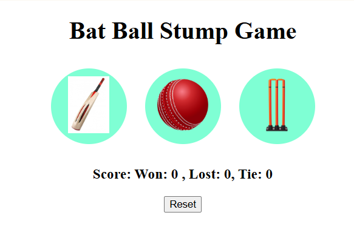

# 🏏 Bat Ball Stump Game

A fun mini-game built using **HTML, CSS, and JavaScript**, inspired by cricket — choose Bat, Ball, or Stump and challenge the computer!

## 💻 Features

- Clean and simple UI
- Responsive layout
- Keeps track of Wins, Losses, and Ties
- Reset option to restart the score

## 🚀 Live Demo

🔗 https://tanyav-rshney.github.io/bat-ball-stump-game/

## 📸 Preview

## 🛠️ Tech Stack

- HTML
- CSS
- JavaScript (DOM manipulation and game logic)

